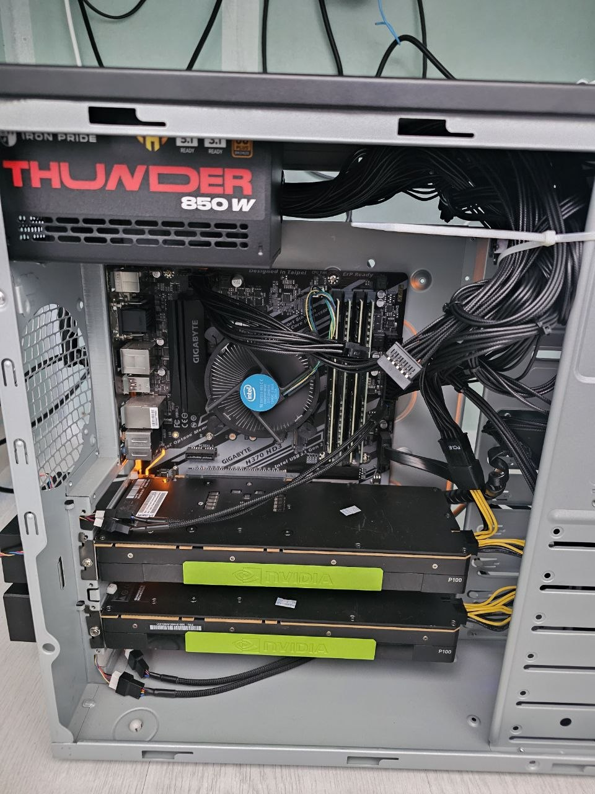
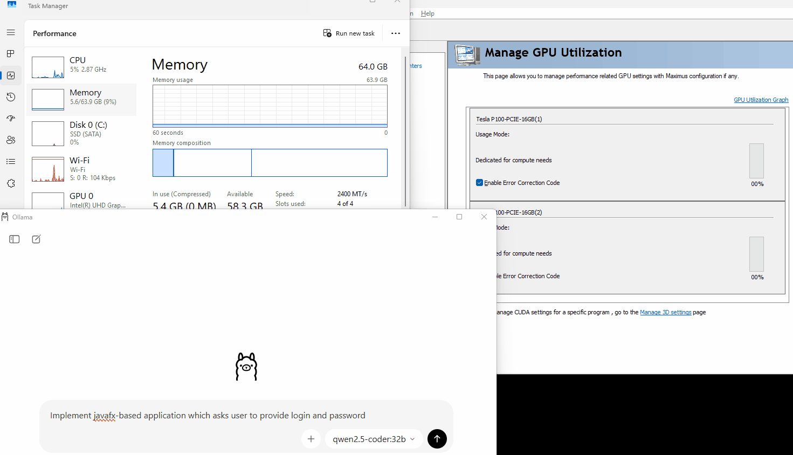
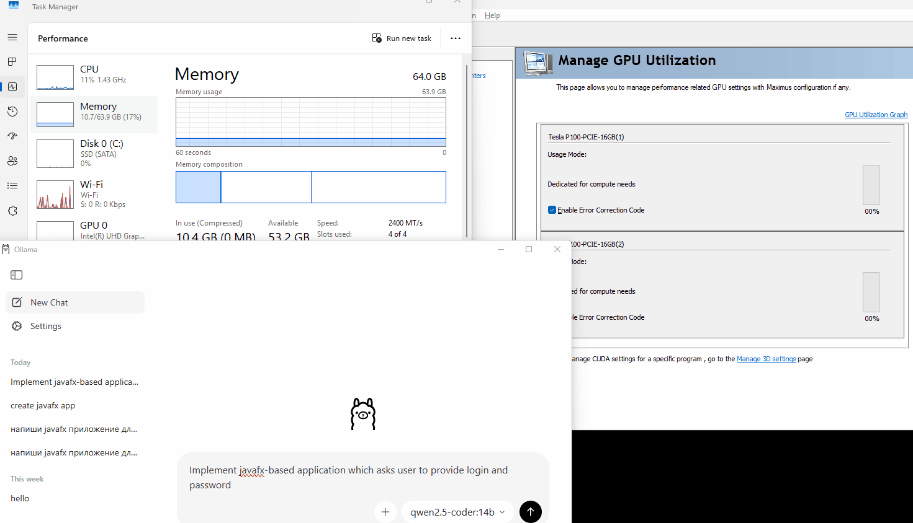
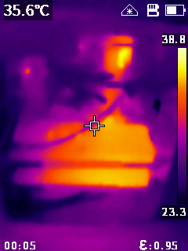

# How to set up a Tesla P100 video card in compute mode on a Gigabyte H370 HD3 (rev.1) motherboard

## One video card configuration
### My initial configuration
* Motherboard = Gigabyte H370 HD3
* CPU = Intel Core i5-8400
* Mem = 64 GB (DDR4 16 GB x 4, 2400 MT/s)
* BIOS = version "F10"
* GPU = Tesla P100 (inserted into PCIe x16 upper slot)
* Power supply unit = 500W (one PCIe cable 6+2)

### Required BIOS settings
1. Update BIOS to F17. I tested with this version because the `Resizable BAR` option is not available in F10.
   Note: after the BIOS update, my pre-installed Windows 11 did not boot normally. I did not troubleshoot this and instead performed a clean Windows installation on my workstation.
2. Intel Platform Trust Technology (PTT) = Enabled (required for Windows 11 installation)
3. Above 4G Decoding = Enabled (required for the video card to use 16 GB of VRAM)
4. CSM Support = Disabled (required for full UEFI mode)
5. Resizable BAR = Auto (required for the video card to use 16 GB of VRAM)

### Install Windows 11
I tested everything with Windows 11 Pro installed in UEFI mode.

### Install NVIDIA drivers
You need NVIDIA Data Center Drivers. You can find the required version on the official site:
[https://www.nvidia.com/en-us/drivers/](https://www.nvidia.com/en-us/drivers/)

I used the Tesla P100 driver version `539.64` for Windows 11 with CUDA 12.2 because the newer CUDA 13.1 package (driver version `591.59`) could not be installed during my previous attempts.

Run the installation in Custom mode, deselect `RTX Desktop Manager`, and install only `Graphics Driver`.

After installation, check Windows Device Manager. The Tesla P100 should operate normally.
If you see error `Code 12: This device cannot find enough free resources that it can use`, check the BIOS settings listed above.

### Ollama
Modern versions of Ollama do not require any additional setup. In my case, Ollama used the Tesla P100 by default.

You can monitor Tesla usage in NVIDIA Control Panel under GPU utilization.

Useful links:
* Gigabyte Drivers: [https://www.gigabyte.com/Motherboard/H370-HD3-rev-10/support](https://www.gigabyte.com/Motherboard/H370-HD3-rev-10/support)
* NVIDIA Drivers: [https://www.nvidia.com/en-us/drivers/](https://www.nvidia.com/en-us/drivers/)
* Switching Tesla P100 to WDDM: [https://github.com/FilipchukAl/launch_Tesla_P100](https://github.com/FilipchukAl/launch_Tesla_P100) (not tested yet)

## Two video card configuration
### Updated configuration
* Power supply was upgraded from 500W to 850W to add more PCIe cables.
* Second Tesla P100 was installed into the bottom PCIe slot (with a limited number of PCIe lanes available).



### Changes made in the OS
To use both video cards we need to set up the following system property:
```
CUDA_VISIBLE_DEVICES=0,1
```

To allow Ollama to spread the workload across both video cards, also set the following system property:
```
OLLAMA_SCHED_SPREAD=1
```

Ensure the changes are applied (reboot is recommended).

### Running QWEN2.5-CODER:32B on two video cards
<details>
<summary>Show GIF animation of a running query</summary>



</details>

### Running QWEN2.5-CODER:14B
<details>
<summary>Show GIF animation of a running query</summary>



</details>
Not sure, but I see two video cards were used in this scenario, probably the spreading mode should be disabled (TBD).


### Current temperature
I checked the temperature externally with a thermal imager; it showed no more than 39C for both cards.


